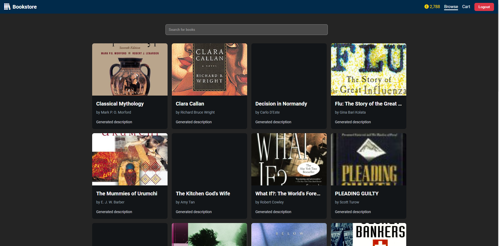
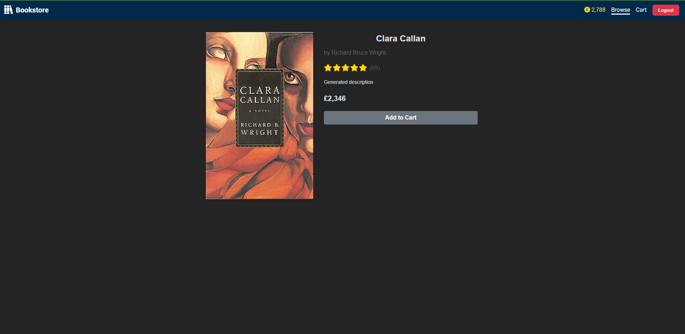
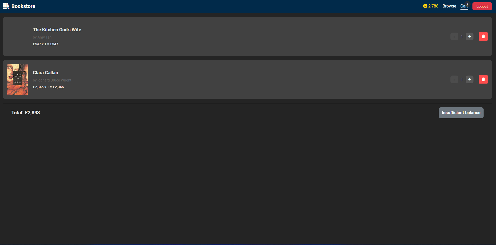

# React Book Store Project

This repository contains a blank starter file for the project. To start project, run

```bash
npm install
npm run dev
```

## Objective

Create a React-based web application for an online book store that allows users to browse books, add them to a cart, and make purchases if authenticated. This project will test candidates' understanding of React, including optimization, error handling, state management, routing, and other frontend concepts.

## Key Features

### Book Browsing

-   Display a list of books with details (title, author, price, cover image). Implement using pagination or infinite scroll (Not required but quite optimal).
-   Add search functionality to filter books by title or author.

### Shopping Cart

-   Allow users to add books to a cart.
-   Display the cart with added books and total price.
-   Implement the ability to adjust quantities or remove items from the cart.

### User Authentication

-   Create a login/signup system.
-   Implement protected routes for authenticated users.
-   Display user information and purchase credit for logged-in users.

### Checkout Process

-   Allow only authenticated users to proceed to checkout.
-   Verify if the user's purchase credit is sufficient for the total cart value.
-   Implement a mock purchase process, updating the user's credit after a successful transaction.

## Technical Requirements

### State Management

-   Use React Context API or Redux (preferably) for cart state management.
-   Implement local component state where appropriate.

### Routing

-   Use React Router for navigation between different pages/views.
-   Implement protected routes for authenticated-only pages.

### Optimization

-   Adopt optimisation strategies such as React hooks and pure components

### Error Handling

-   Implement error boundaries to catch and display errors gracefully.
-   Add form validation for user inputs (e.g., login, signup, checkout).
-   Handle API errors and display user-friendly error messages.

### API Integration

-   Connect your app to the provided endpoint (details in ). Handle API integration the way you’re familiar with (Tanstack Query preferable but not necessary).
-   Implement proper loading states and error handling for API calls.

### Additional Notes

-   The project should be in TypeScript.
-   You may use external libraries when needed.

## Bonus Challenges

-   Write unit tests for critical components and functions where necessary (optional).

### Styling

-   Make the application responsive for different screen sizes (Vanilla CSS/SASS module preferable but not necessary).

## Evaluation Criteria

-   Code organization and project structure
-   Proper use of React hooks and functional components
-   Effective state management and data flow
-   Routing implementation and protected routes handling
-   Error handling and input validation
-   Performance optimizations
-   UI/UX design and responsiveness
-   Code quality, readability, and best practices
-   Testing coverage and quality

This project specification covers various aspects of React development and should provide a comprehensive assessment of your skills and proficiency in core React concepts.

## Design Idea





